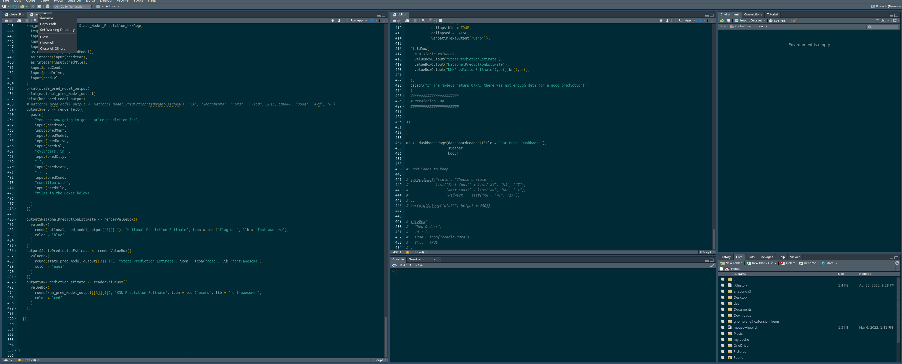

# Car Price Dashboard Shiny App


# Setup and Introduction

This repo is the final result of many hours of hard work for a class project in MGT 6203 at [Georgia Tech M.S. Data Analytics](https://catalog.gatech.edu/programs/analytics-ms/)
## Problem Statement 

“A devastating shortage of microchips — which are necessary for all manner of critical electrical components — is slowing car production worldwide, choking the supply of new models and driving their prices skyward. High dealer markups and a lack of options are forcing more buyers to shop secondhand, chipping away at used-car inventories” - [Business Insider](https://www.businessinsider.com/why-are-used-cars-so-expensive-now-shortages-pandemic-rentals-2021-7) 

## Objective 
### *(theoretical staged setup, Penske was not involved in any way shape or form)*
Our company, Eagle Fang Data Consulting, has been hired by Penske Motor group, LLC to investigate potential arbitrage opportunities in the used car market. The objective of this project is to create a model to predict automobile prices in different regions of the country and build an app that allows used car managers to quickly compare prices. To supplement our data set and improve the accuracy of our model, Penske Motor Group has also asked us to use regional economic data to strengthen our predictions. 

## App description

The goal of this project is to demonstrate the development of a complete data service entirely written in the statistical programming language R of a dataset of Car Price Data from [Kaggle](https://www.kaggle.com/austinreese/craigslist-carstrucks-data).

 Besides this web application, the project includes the creation of a sqlite database, cleaning, processing, and analysis of data, and simple linear and KNN models to predict prices given a user selected Manufacturer, Make/Model, Year, condition, location, etc. 
 
 Additionally, efforts were made to develop this project in a reproducible way by controlling the operating environmentand the used R version (through Docker containers), a complete list of all required R packages and their specific versions (through `renv`) with the intention to  promote collaborative development and to reduce the friction of the setup process of R projects in heterogeneous development environments.

## Shiny app

This web application is written using the [R Shiny](https://shiny.rstudio.com/) and [R Shiny Dashboard](https://rstudio.github.io/shinydashboard/) web framework. It demonstrates the use of custom HTML templates in Shiny apps to create a fancy user experience. The app was developed with best Shiny practices in mind, e.g. the use of Shiny modules. In total about 1,000 lines of code were written for this app in roughly 120+ hours, from which the main developer didn't know any R to begin with! This time included app ideation and all required research of data sources, data preparation and its operationalisation, app development, design and how to best present the information. Additionally searching for raw data to merge with the dataset such as the U.S. Census data was used in order to help find a supplimental dataset that would help models and explore the combination of completely different data.


## Setup development environment

The development environment of this project is currently just using [renv](https://rstudio.github.io/renv/articles/renv.html), to setup all the required packages from a fresh environment, clone the repo, cd into the `app/` directory and run


```R
install.packages('renv', dependancies = TRUE) # if not already installed
renv::restore()
```

**_NOTE:_** **_If the following error with occurs, resolve with the following: `install.packages("RcppArmadillo", dependencies = T)`_**

**_If using this app in linux (with an apt package manager) or Mac, install the following: r-cran-rcpparmadillo, libblas-dev, liblapack-dev, libcurl4-openssl-dev libxml2-dev additionally, ensure on linux the following command is run: `sudo ln -s /usr/lib/x86_64-linux-gnu/libgfortran.so.3 /usr/lib/x86_64-linux-gnu/libgfortran.so`_**

(Docker Container to come soon!)

<br>
<br>
<br>


# Running the Shiny Dashboard app 

Once all dependancies are met, some setup to database and data paths are needed! Here is a list of items that would need to be completed in order for the app to run properly (locally)

1. Move into the main directory `cd MGT6203-GRP-PROJECT`
2. Download the following database files from the public OneDrive link:
   * [CraigslistCarsClean.sqlite3](https://1drv.ms/u/s!Ahk80qDLp1S2qa5DZW5DvBfLCif3hA?e=FhknY4)
   * [Top_5_Manufacturers.sqlite3](https://1drv.ms/u/s!Ahk80qDLp1S2qa5CGugrLV0X2hOa-g?e=FABwfo)

3. Place the `.sqlite3` files in the `database` folder as seen in the file structure below
<-- Where the database needs to live
```console
MGT6203-grp-project
├── analysis (misc files plotting and looking at data)
│   ├── EDA_MASTER.Rmd
│   ├── model_comparison_jy_final.Rmd
│   ├── Random_Forest_Shawn.R
│   └── variable selection.R
├── app (where the ui and server lives)
│   ├── app.Rproj
│   ├── global.R
│   ├── Models_Matt.R
│   ├── Plots_Angie.R
│   ├── renv
│   ├── renv.lock
│   ├── server.R
│   ├── ui.R
│   └── www
├── database 
│   ├── CraigslistCarsClean.sqlite3
│   └── Top_5_Manufacturers.sqlite3
├── Dockerfile
├── docs
│   ├── team36finalreport.pdf
│   └── team36slides.pdf
├── images
│   ├── demo.gif
│   └── setup.gif
├── preprocessing 
│   └── *.csv (raw_data_lives_here)
└── README.md

```
**_NOTE:_** Depending on the platform the user is running, it's possible that changing the file paths of the database ***might*** be needed. In that case they're lines 16 & 21 in `server.R` if the `table_list` on line 29 prints out, the user has successfully hooked the database into the app and should see an output similar to the gif example above. Additionally it's a good idea to right click the `server.R` file and "Set Working Directory" to ensure the app is run in the correct folder location in RStudio

## Contributing
Pull requests are welcome! For major changes, please open an issue first to discuss what you would like to change.

### Required Software 
- [RStudio](https://www.rstudio.com/)
- [`R>=4.1.3`](https://cran.r-project.org/)

## License


[MIT](https://choosealicense.com/licenses/mit/) © [Andrew Bartels](https://github.com/andrewbartels1)
      [Matt Palmer]
      [Shawn Azzu]
      [Ngoc "Angie" Nguyen]
      [Jason Young]